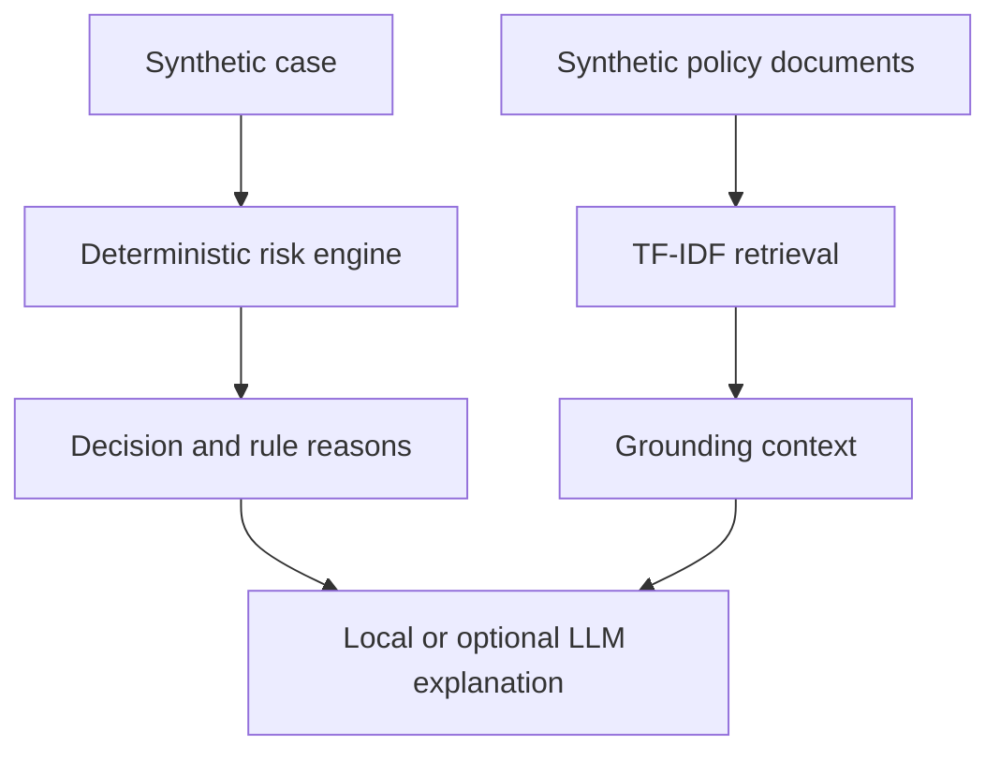

# GenAI Risk Analyst Pro

An educational prototype that separates deterministic risk rules, TF-IDF document retrieval and optional LLM explanations.

> This repository uses fictional policies and synthetic cases. It must not be used for real credit, financial, compliance, insurance, employment or eligibility decisions.

## Why this architecture

A language model should not silently determine a high-stakes classification. In this prototype:

1. Python rules calculate the demonstration classification.
2. TF-IDF retrieval selects relevant synthetic policy documents.
3. The optional LLM explains the existing decision and cannot change it.
4. The interface displays the rule reasons, policy version and retrieved sources.

## Architecture



| Component | Responsibility |
|---|---|
| `risk_engine.py` | Typed policy, case validation and deterministic classification |
| `retrieval.py` | TF-IDF document indexing, ranking and source scores |
| `explanations.py` | Local explanation that requires no external service |
| `llm_service.py` | Optional explanation adapter; it receives the existing decision |
| `app.py` | Streamlit interface for the synthetic demonstration |
| `tests/` | Boundary, classification and retrieval tests |

## Run locally

```bash
python -m venv .venv
source .venv/bin/activate
pip install -r requirements.txt
streamlit run app.py
```

On Windows PowerShell:

```powershell
.venv\Scripts\Activate.ps1
```

The application works without an API key. To enable optional explanations:

```bash
cp .env.example .env
```

Set `OPENAI_API_KEY` in `.env`. The OpenAI mode is disabled by default.

## Run tests

```bash
python -m unittest discover -s tests -v
```

The tests cover threshold boundaries, manual-review flags, invalid inputs, retrieval ranking, result limits and empty questions.

## Demonstration rules

The bundled `demo_policy.json` contains fictional score thresholds and review flags. They exist to make the software behavior reproducible, not to represent a real institution's underwriting policy.

The application never performs an approval. Its output contains:

- A synthetic classification.
- Whether a demonstration manual-review flag was triggered.
- Transparent rule reasons.
- The active fictional policy version.
- Retrieved synthetic source documents.

## What changed from the initial prototype

- Removed the claim that the project simulates a named company's real process.
- Replaced a single mixed module with separate decision, retrieval and explanation layers.
- Prevented the LLM from changing the deterministic classification.
- Removed personal-looking example data and replaced it with a generic case identifier.
- Added explicit safety boundaries, typed models and automated tests.

## Limitations

- TF-IDF retrieval is lexical and does not provide semantic embeddings.
- The policy and case are intentionally small and synthetic.
- There is no authentication, audit database, model evaluation or production monitoring.
- The prototype does not satisfy regulatory, fairness or explainability requirements for real decisions.

## Next steps

- Add retrieval evaluation fixtures and citation-quality metrics.
- Add immutable decision logs without personal data.
- Introduce access controls and policy-version lifecycle management.
- Add a formal risk and fairness assessment before any non-demo use.

## Author

Henrique Sembla — [GitHub](https://github.com/Sembla) · [LinkedIn](https://www.linkedin.com/in/henriquessembla)
